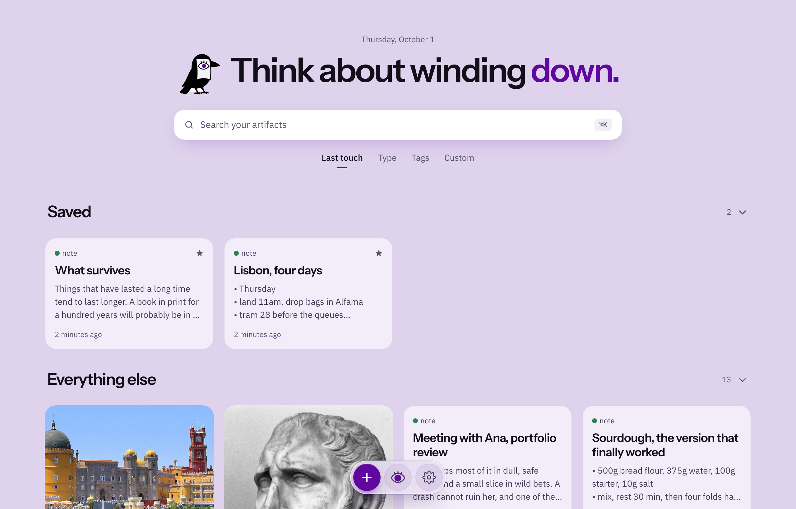
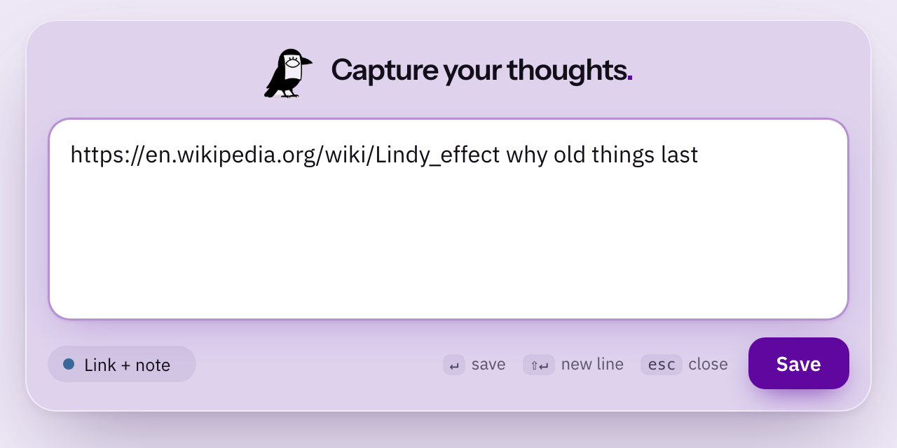
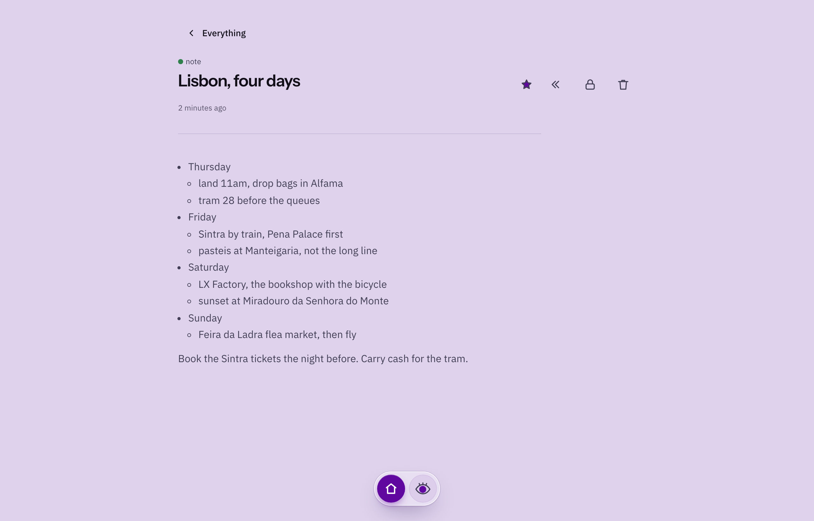

<p align="center">
  
</p>

<h1 align="center">Enqueue</h1>

<p align="center">
  <strong>Save first. Organise never.</strong><br>
  A private place for everything you want to keep, that finds it again by what it means.
</p>

<p align="center">
  <a href="docs/MANUAL.md">Manual</a> ·
  <a href="docs/DEVELOPING.md">Build from source</a> ·
  <a href="https://github.com/sudohnim/enqueue/releases">Android app</a>
</p>

<p align="center">
  
</p>

---

Most tools make you decide where a thing goes before they will take it.
A folder, a tag, a title, a notebook.
So you stop saving things, or you save them and never find them.

Enqueue takes the thing and asks nothing.
Notes, links, PDFs, photos, files: one keystroke and it is kept.
The organising happens later, by itself, and you find things the way you remember them: by the idea, not the filename.

It runs on your own Mac.
Your library is one file in one folder, and nothing leaves unless you say so.

## Capture in one keystroke



Press **Option+Shift+E** from anywhere.
Type a thought, paste a link, or drop a file.
Press Enter.

The raven flies off with it and you are back in what you were doing.
No folder to pick, no form to fill.

<br clear="right">

## Find it by the idea

You saved a note about lifting weights, a PDF about forests, and a line your grandmother said.
None of them contains the word "antifragile".
Search for *things that get stronger under stress* and they come back together.

Every item is read once when you save it, and remembered three ways: by its words, by its meaning, and by the ideas it is an example of.
Typos, half-words and exact phrases work too.
And when you never saved anything on a subject, Enqueue says **nothing found** instead of inventing a match.

## Ask your own library

Click the eye and ask in plain words.
The answer is written from what you saved, and names the items it came from.
If your library does not hold the answer, it tells you so.

## Write on a page, not in a form



A note is just the page.
Type and it is saved; every earlier version is kept.
Markdown turns into formatting as you write, lists nest with Tab, and nothing ever asks you to press Save.

## It reads what you keep

Each item gets a short summary of what it says and what it is an example of.
That summary is what makes search understand ideas.
It is yours to correct: rewrite a line, add your own, and search follows.

## In your pocket

The Android app carries your whole library.
Read, capture, write and ask, with or without a connection: everything saves on the phone first and reaches your Mac when it can.
Long-press the icon for a capture box that floats over whatever app you are in.

Linking a phone is one QR code.
No account, no password.

## Yours, and only yours

- **On your machine.** The library is a single SQLite file in `~/.enqueue-poc`, with your original files beside it, untouched. Any tool can read it. If Enqueue vanished tomorrow, you would still have everything.
- **Your choice of model.** Run the AI on your own Mac with Ollama and nothing leaves it. Or point it at a hosted model and decide, per item, what may never be sent.
- **Sync that cannot be read.** Mac and phone sync through a relay that only ever holds scrambled data. The key never leaves your devices.
- **Backups in your own cloud.** A daily copy goes into your Proton Drive, encrypted end to end. A 400 MB library backs up as about 6 MB.
- **A vault for the rest.** Lock an item behind a PIN and it leaves search, answers, and the wall, encrypted even on your own devices.
- **Nothing is lost by accident.** Edits keep every version. Deleting waits 30 days in the trash.

## How it fits together

```
your Mac                                   your phone
┌──────────────────────────────┐          ┌───────────────────────┐
│ desktop window  (Tauri)      │          │ Android app  (Tauri)  │
│        │                     │          │   its own copy of     │
│ engine (Python, localhost)   │◄────────►│   the library         │
│   one SQLite file + files    │  relay:  └───────────────────────┘
│   search index inside it     │  encrypted
└──────────────────────────────┘  end to end
```

One local engine, one file, no cloud service of ours in the middle.
The details are in [AGENTS.md](AGENTS.md).

## Get it

Enqueue runs from source on macOS today.

```bash
git clone https://github.com/sudohnim/enqueue.git
cd enqueue
bin/setup            # Rust, uv, Python 3.12: checks and installs what is missing
uv sync
bin/launch desktop
```

For the AI features, either run [Ollama](https://ollama.com) locally or add a hosted model's key in Settings.
Capture, notes and search work without any model at all.

The Android app is on the [Releases](https://github.com/sudohnim/enqueue/releases) page.

- **[The manual](docs/MANUAL.md)**: everything the app does, and how.
- **[Developing](docs/DEVELOPING.md)**: building, the Android app, the relay, tests, configuration.
- **[Running a relay](docs/sync-relay.md)**: hosting your own sync relay.
- **[Design](docs/DESIGN.md)**: the look, and the rules behind it.

## Where it stands

Enqueue is one person's daily tool, built in the open.
It is not polished software from a company, and it says so:

- macOS for the desktop, Android for the phone. No Windows, Linux or iOS yet.
- There is no installer for the Mac yet; you run it from this repository.
- Small local models write weak summaries. A capable model, local or hosted, makes search by idea far better.
- The library on your Mac is not encrypted by Enqueue itself; your disk's encryption (FileVault) is what protects it there. What leaves the Mac is encrypted.

## License

[AGPL-3.0](LICENSE).

<sub>The screenshots are a demo library, made by <code>bin/screenshots</code>.</sub>
